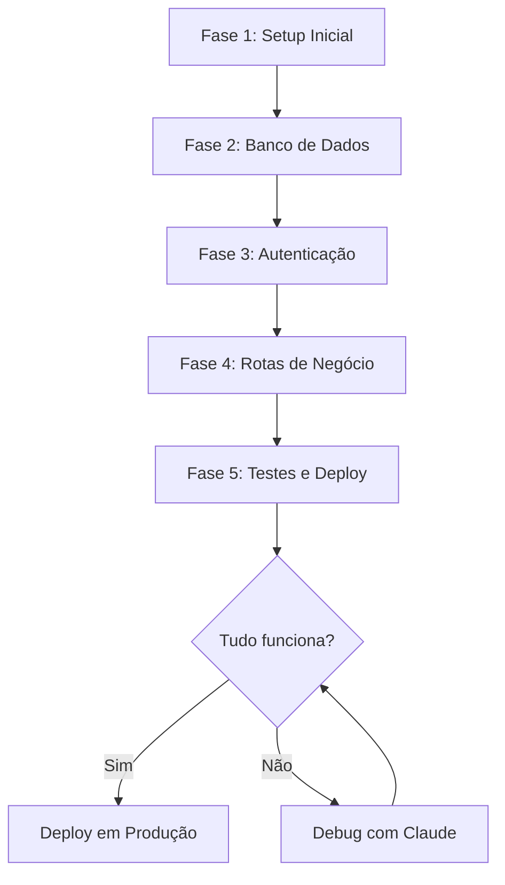

# 🤖 Workflow Otimizado com Claude

## 📋 Estratégia de 5 Fases

Este documento guia você no desenvolvimento do backend usando Claude de forma eficiente e organizada.

---

## 🎯 VISÃO GERAL



---

## 📝 FASE 1: SETUP INICIAL (30-45 min)

### Objetivos:
- ✅ Criar estrutura de pastas
- ✅ Configurar FastAPI básico
- ✅ Configurar CORS
- ✅ Sistema de configurações

### Conversa com Claude:

**PROMPT 1:**
```
Preciso criar um backend REST API em Python para uma plataforma educacional.

Requisitos técnicos:
- FastAPI (Python 3.11+)
- Estrutura modular e escalável
- CORS configurado para http://localhost:5173 e https://*.lovable.app
- Sistema de configurações com variáveis de ambiente
- Logging estruturado

Crie:
1. Estrutura de pastas completa
2. main.py com FastAPI básico
3. config.py para gerenciar variáveis de ambiente
4. requirements.txt inicial

Use boas práticas de Python e explique cada decisão.
```

**PROMPT 2:**
```
Agora adicione:
1. Middleware de logging de requisições
2. Tratamento de erros global
3. Health check endpoint em /health
4. Documentação automática do Swagger

Explique como cada parte funciona.
```

### ✅ Checkpoint:
```bash
# Testar se funciona:
pip install -r requirements.txt
python main.py

# Acessar: http://localhost:8000/docs
# Deve mostrar Swagger UI
```

---

## 🗄️ FASE 2: BANCO DE DADOS (45-60 min)

### Objetivos:
- ✅ Configurar SQLAlchemy
- ✅ Criar modelos de dados
- ✅ Configurar migrations
- ✅ Criar schemas Pydantic

### Conversa com Claude:

**PROMPT 3:**
```
Configure SQLAlchemy com PostgreSQL assíncrono.

Estrutura de tabelas:
[Cole o conteúdo da seção "Banco de Dados" do API_DOCUMENTATION.md]

Preciso de:
1. database/connection.py - Configuração de conexão
2. database/models.py - Modelos SQLAlchemy com:
   - Campos base (id, created_at, updated_at)
   - Relacionamentos corretos
   - Índices em campos de busca
3. Configuração de Alembic para migrations

Use async/await para melhor performance.
```

**PROMPT 4:**
```
Agora crie os schemas Pydantic em schemas/:

Para cada modelo, preciso de:
- Schema Create (validação de entrada)
- Schema Response (saída da API)
- Schema Update (atualização parcial)

Validações necessárias:
- name: 3-100 caracteres
- email: formato válido, max 255 caracteres  
- password: mínimo 6 caracteres
- grade: 0.0-10.0
- message: max 1000 caracteres

Adicione validators customizados onde necessário.
```

### ✅ Checkpoint:
```bash
# Criar banco:
alembic init alembic
alembic revision --autogenerate -m "initial"
alembic upgrade head

# Verificar tabelas criadas no PostgreSQL
```

---

## 🔐 FASE 3: AUTENTICAÇÃO (45-60 min)

### Objetivos:
- ✅ Sistema de hash de senhas
- ✅ Geração e validação de JWT
- ✅ Middleware de autenticação
- ✅ Rotas de registro e login

### Conversa com Claude:

**PROMPT 5:**
```
Implemente autenticação JWT completa.

Requisitos de segurança:
- Usar bcrypt para hash de senhas
- JWT com algoritmo HS256
- Token expira em 24h
- SECRET_KEY vem de variável de ambiente
- Rate limiting no login (max 5 tentativas/minuto)

Crie:
1. services/auth_service.py com:
   - hash_password()
   - verify_password()
   - create_access_token()
   - verify_token()
   - get_current_user() (dependency)

2. middleware/auth_middleware.py
   - Verificar Authorization header
   - Extrair e validar token
   - Adicionar user ao request

Explique o fluxo de autenticação.
```

**PROMPT 6:**
```
Agora crie as rotas de autenticação em routes/auth.py:

POST /api/auth/register:
- Validar se email já existe
- Hash da senha
- Criar usuário no banco
- Retornar user (sem password_hash)

POST /api/auth/login:
- Buscar user por email
- Verificar senha
- Gerar JWT token
- Retornar token + user

GET /api/auth/me:
- Rota protegida
- Retornar dados do usuário logado

Adicione tratamento de erros amigável.
```

### ✅ Checkpoint:
```bash
# Testar com curl:

# Registro:
curl -X POST http://localhost:8000/api/auth/register \
  -H "Content-Type: application/json" \
  -d '{"name":"Teste","email":"teste@email.com","password":"123456","user_type":"student"}'

# Login:
curl -X POST http://localhost:8000/api/auth/login \
  -H "Content-Type: application/json" \
  -d '{"email":"teste@email.com","password":"123456"}'

# Copiar o token e testar /me:
curl http://localhost:8000/api/auth/me \
  -H "Authorization: Bearer SEU_TOKEN_AQUI"
```

---

## 📚 FASE 4: ROTAS DE NEGÓCIO (60-90 min)

### Objetivos:
- ✅ Rotas do aluno
- ✅ Rotas do professor
- ✅ Sistema de upload de arquivos

### Conversa com Claude:

**PROMPT 7:**
```
Implemente as rotas do aluno em routes/student.py.

Referência: API_DOCUMENTATION.md seção "Rotas do Aluno"

GET /api/student/subjects:
- Buscar matérias onde student_id está em enrollments
- Join com subjects para pegar nome
- Join com users para pegar nome do professor
- Incluir grade do enrollment
- Rota protegida (usar get_current_user)

GET /api/student/materials:
- Buscar materiais das matérias do aluno
- Join através de enrollments
- Ordenar por uploaded_at DESC
- Limitar a 50 resultados

GET /api/student/messages:
- Buscar mensagens das matérias do aluno
- Join através de enrollments
- Incluir nome do professor (from_user_id)
- Ordenar por created_at DESC

Use queries otimizadas (eager loading).
```

**PROMPT 8:**
```
Implemente as rotas do professor em routes/teacher.py.

GET /api/teacher/classes:
- Buscar subjects onde teacher_id = user_id
- Incluir contagem de enrollments (alunos)

GET /api/teacher/students?class_id=X:
- Validar se subject pertence ao professor
- Buscar students através de enrollments
- Retornar lista de alunos

POST /api/teacher/grades:
- Validar se aluno está na turma
- Validar se turma é do professor
- Atualizar grade no enrollment

POST /api/teacher/messages:
- Validar se turma é do professor
- Criar mensagem no banco
- Associar com subject

Adicione validações de autorização.
```

**PROMPT 9:**
```
Crie sistema de upload em services/storage_service.py.

Requisitos:
- Aceitar apenas: PDF, DOC, DOCX, PPT, PPTX, ZIP
- Tamanho máximo: 10MB
- Gerar nome único: uuid4 + extensão
- Salvar em pasta uploads/
- Retornar URL relativa: /uploads/{filename}

Implemente POST /api/teacher/materials:
- Receber file via FormData
- Validar arquivo
- Salvar usando storage_service
- Criar registro no banco
- Retornar material criado

Adicione tratamento de erros de upload.
```

### ✅ Checkpoint:
```bash
# Testar cada endpoint:

# Login para pegar token:
TOKEN=$(curl -X POST http://localhost:8000/api/auth/login \
  -H "Content-Type: application/json" \
  -d '{"email":"aluno@email.com","password":"123456"}' \
  | jq -r .token)

# Testar rotas do aluno:
curl http://localhost:8000/api/student/subjects \
  -H "Authorization: Bearer $TOKEN"

# Testar upload (professor):
curl -X POST http://localhost:8000/api/teacher/materials \
  -H "Authorization: Bearer $TOKEN_PROFESSOR" \
  -F "class_id=1" \
  -F "title=Algebra" \
  -F "file=@teste.pdf"
```

---

## 🧪 FASE 5: TESTES E DEPLOY (60-90 min)

### Objetivos:
- ✅ Testes automatizados
- ✅ Docker
- ✅ Deploy

### Conversa com Claude:

**PROMPT 10:**
```
Crie testes com pytest em tests/.

Preciso de:

1. tests/conftest.py:
   - Fixture: test_client (FastAPI TestClient)
   - Fixture: test_db (banco de dados de teste)
   - Fixture: test_user_student
   - Fixture: test_user_teacher
   - Fixture: auth_headers

2. tests/test_auth.py:
   - test_register_success
   - test_register_duplicate_email
   - test_login_success
   - test_login_wrong_password
   - test_get_me_success
   - test_get_me_no_token

3. tests/test_student.py:
   - test_get_subjects_success
   - test_get_subjects_unauthorized
   - test_get_materials_success
   - test_get_messages_success

4. tests/test_teacher.py:
   - test_get_classes_success
   - test_submit_grade_success
   - test_submit_grade_invalid_range
   - test_upload_material_success
   - test_upload_material_invalid_type

Use fixtures e mock onde necessário.
```

**PROMPT 11:**
```
Crie configuração Docker:

1. Dockerfile multi-stage:
   - Stage 1: Build dependencies
   - Stage 2: Runtime image (slim)
   - Usar Python 3.11-slim
   - Copiar apenas necessário
   - Usuário não-root
   - CMD para executar uvicorn

2. docker-compose.yml:
   - Serviço app (FastAPI)
   - Serviço db (PostgreSQL 15)
   - Volumes persistentes
   - Networks
   - Health checks
   - Variáveis de ambiente

3. .dockerignore:
   - Arquivos desnecessários

Otimize para tamanho e segurança.
```

**PROMPT 12:**
```
Prepare para deploy no Railway:

1. Crie railway.json com configurações
2. Atualize README.md com:
   - Instruções de setup
   - Como rodar localmente
   - Como fazer deploy
   - Variáveis de ambiente necessárias
3. Adicione scripts úteis no README:
   - Rodar testes
   - Rodar migrations
   - Popular banco com dados de teste

Explique cada passo do deploy.
```

### ✅ Checkpoint Final:
```bash
# Rodar testes:
pytest --cov=. --cov-report=html

# Build Docker:
docker-compose up --build

# Verificar se tudo funciona:
curl http://localhost:8000/health
```

---

## 🐛 DEBUG COM CLAUDE

Se algo não funcionar, use este template:

```
Estou tendo um erro no [PARTE DO CÓDIGO]:

Erro:
[Cole o erro completo]

Código atual:
[Cole o código relevante]

O que já tentei:
- [Tentativa 1]
- [Tentativa 2]

Contexto adicional:
- Python version: 3.11
- OS: [seu OS]
- Já funciona: [o que já funciona]
- Não funciona: [o que não funciona]

Como resolver?
```

---

## 📊 MÉTRICAS DE SUCESSO

Após cada fase, verifique:

### Fase 1:
- [ ] Servidor inicia sem erros
- [ ] Swagger UI acessível
- [ ] Health check responde

### Fase 2:
- [ ] Migrations rodam com sucesso
- [ ] Tabelas criadas no banco
- [ ] Schemas validam dados corretamente

### Fase 3:
- [ ] Registro cria usuário
- [ ] Login retorna token
- [ ] Token é validado corretamente

### Fase 4:
- [ ] Todas as rotas respondem
- [ ] Autorizações funcionam
- [ ] Upload funciona

### Fase 5:
- [ ] Testes passam (>70% coverage)
- [ ] Docker builds com sucesso
- [ ] Deploy funciona

---

## 💡 DICAS PRO

### 1. Salve as conversas
Cada conversa com Claude é valiosa. Salve-as para referência.

### 2. Itere incrementalmente
Não peça tudo de uma vez. Construa em camadas.

### 3. Peça explicações
Sempre: "Explique como isso funciona e por que essa abordagem"

### 4. Revise segurança
A cada fase: "Há alguma vulnerabilidade de segurança aqui?"

### 5. Peça testes
Para cada feature: "Crie testes para validar isso"

### 6. Use o Claude para debug
Copie erros completos e peça ajuda

### 7. Peça otimizações
Após funcionar: "Como posso otimizar isso?"

---

## 🎯 RESULTADO ESPERADO

Após seguir este workflow, você terá:

✅ Backend Python completo e funcional  
✅ API REST documentada  
✅ Autenticação JWT segura  
✅ Testes automatizados  
✅ Docker pronto para deploy  
✅ Código limpo e bem estruturado  
✅ Pronto para integrar com frontend React  

**Tempo total estimado: 4-6 horas** 🚀
